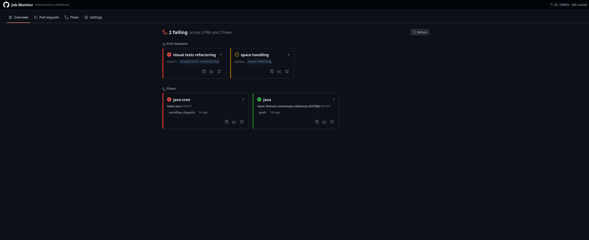
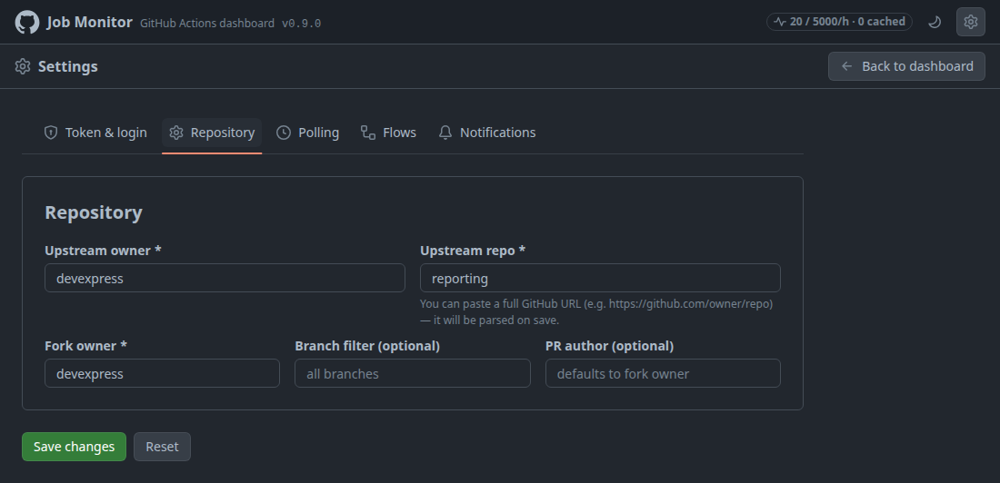
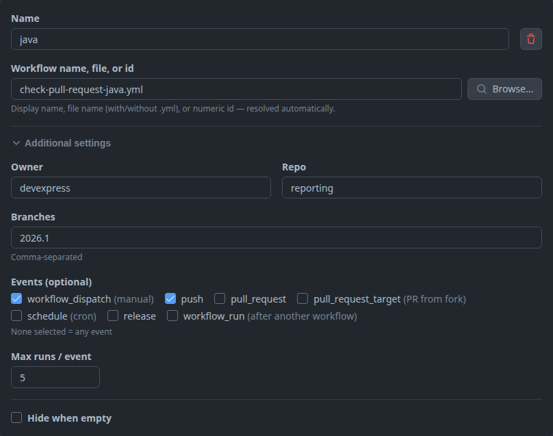
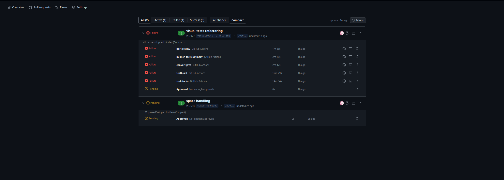
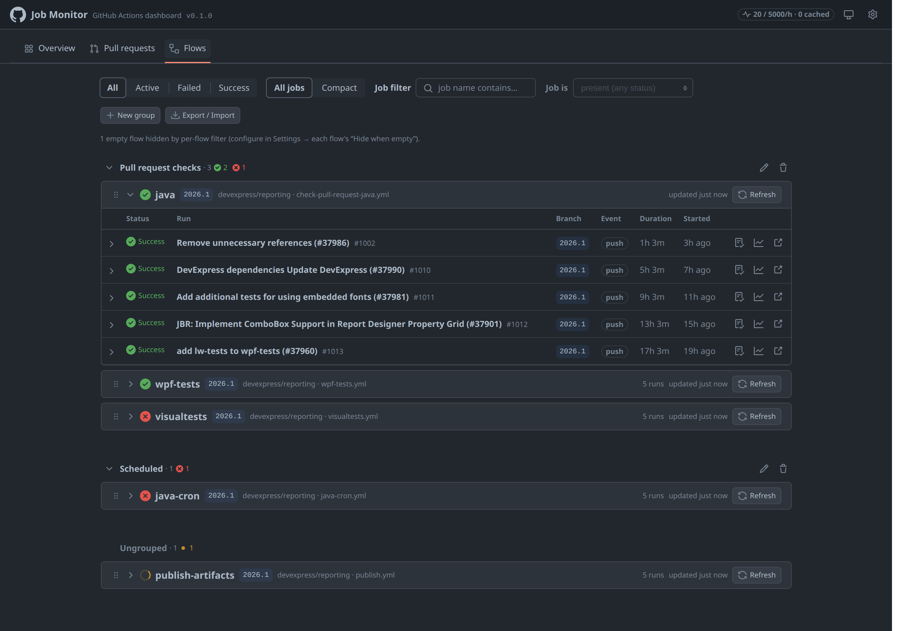
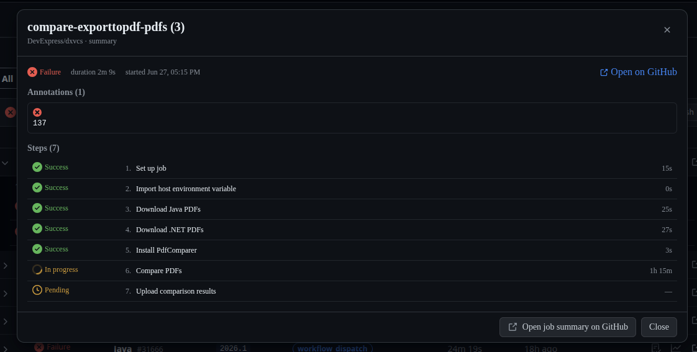
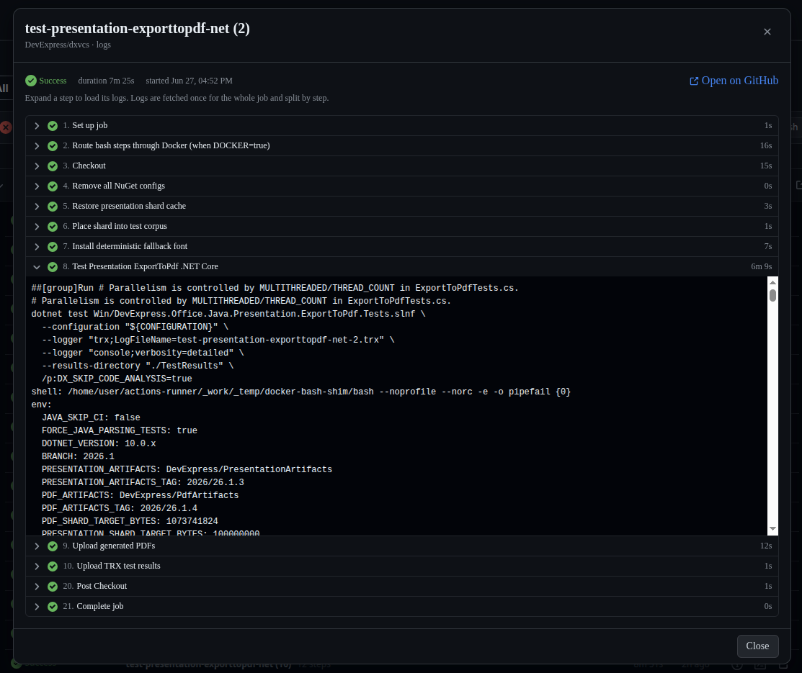
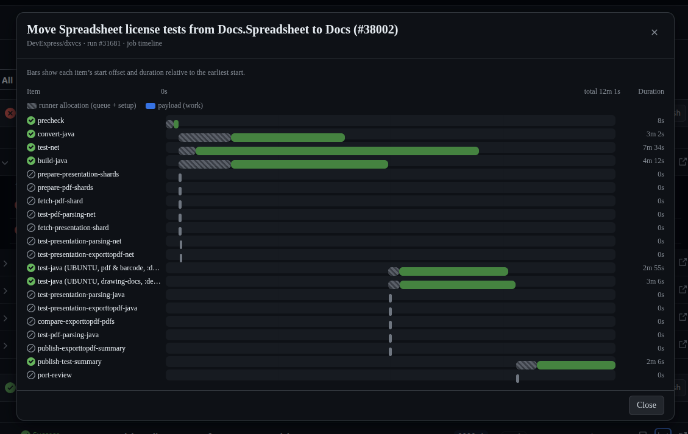

# Job Monitor

**Job Monitor** is a dashboard for keeping an eye on your GitHub Actions — your pull‑request
checks and your workflow “flows” — in one place. It reads everything straight from GitHub with
your own read‑only token; there’s no server, no account, nothing leaves your machine except
requests to `api.github.com`.

Use it in the **browser** (a static web page) or as a **desktop app** (Windows / macOS / Linux)
that lives in the tray and pops a notification when something finishes.

**▶ Live site: <https://ideal-adventure-zzoj21p.pages.github.io/>**

---

## What you get

- A single **Overview** of every PR and flow you track, red/green at a glance.
- **PR checks** with an aggregated status and a drill‑down into every check‑run.
- **Flows** — pick any workflow and watch its runs and jobs, filtered by branch / event.
- **Logs, summaries and timelines** for any job, right inside the app.
- **Desktop notifications** when a PR’s checks or a flow run finish.
- Everything is **read‑only** — Job Monitor never triggers or changes anything on GitHub.

---

## Getting started

### Option A — open the website

Open **<https://ideal-adventure-zzoj21p.pages.github.io/>** in a modern browser
(Chrome/Edge recommended). Nothing to install.

### Option B — install the desktop app

Grab the installer for your OS from the project’s **Releases** page:

| OS | File |
|----|------|
| Windows | `Job Monitor-x.y.z-setup.exe` |
| macOS | `Job Monitor-x.y.z-*.dmg` |
| Linux | `Job Monitor-x.y.z.AppImage` or `.deb` |

> The installers aren’t code‑signed yet, so the first launch may show a Gatekeeper (macOS) or
> SmartScreen (Windows) warning — choose “Open anyway”. On Linux, make the AppImage executable
> (`chmod +x`) and run it.

The desktop app does everything the website does, **plus** it can minimise to the system tray,
keep checking in the background, and show native notifications.

---

## First‑time setup

When you first open Job Monitor you’ll be taken to **Settings**. Three things to do:

### 1. Add your GitHub token (Settings → **Token & login**)

Job Monitor needs a personal access token to read your data. Create a
[**classic token**](https://github.com/settings/tokens/new?scopes=repo&description=Job%20Monitor)
with the **`repo`** scope (or `public_repo` if you only watch public repositories), paste it in,
and choose a **passphrase**.

- The token is **encrypted** with your passphrase and stored only in this browser; the plain token
  lives only in memory and is sent only to `api.github.com`.
- On the desktop app you can tick **“Remember on this device”** to unlock automatically next time
  (stored in your OS keychain).
- After the first run you’ll just be asked for the passphrase to unlock.

> A read‑only **fine‑grained** token works for most things but **can’t download Actions logs**
> (GitHub returns 404), so a classic `repo` token is recommended.

### 2. Point it at a repository (Settings → **Polling**)

- **Upstream owner / repo** — the repository you’re monitoring (you can paste a full GitHub URL).
- **Fork owner** — whose pull requests into upstream you want to see.
- **Branch filter / PR author** — optional narrowing.
- **Polling intervals** — how often to refresh (sensible defaults are filled in).

### 3. Add flows to watch (Settings → **Polling → Flows**)

A *flow* is any workflow you want to track. Give it a name, the workflow file (or its display
name / id), the branches, and optionally the trigger events.

You can also **Hide when empty** — automatically hide a flow when it has no runs, only skipped
runs, no artifacts, or when a named job ended up in a certain state (e.g. a `test` job was skipped).

Click **Save changes** and you’re ready.

---

## Using the dashboard

### Overview

The landing tab rolls everything up: one tile per PR and one per flow, with the latest status,
branch and when it last changed. Click a tile to jump straight to its details. The header badge
shows how many API requests you’ve used in the last hour.

### Pull requests

Every open PR from your fork into upstream, with an overall status. Expand a PR to see all its
check‑runs and commit statuses. Filter by **All / Active / Failed / Success**, and use **Compact**
to hide the green noise and show only what needs attention.

### Flows

Each flow shows its recent **runs**; expand a run to load its **jobs**. Filter runs by status, and
use the **Job filter** to find runs that contain a job matching a name in a given state. **Compact**
hides passed/skipped jobs.

### Job summary, logs and timeline

Every job (and every PR check) has three quick actions:

- **Summary** — the job’s annotations (errors/warnings with file\:line + message) and a per‑step
  status breakdown.

  

- **Logs** — expand any step to read its log lines, fetched on demand.

  

- **Open on GitHub** — jump to the run on github.com.

There’s also a **Timeline** (Gantt) button on each PR and flow run: bars positioned by start time
and sized by duration, splitting **runner allocation** (queue + “Set up job”) from the actual
**work** — so it’s obvious whether time went to waiting or running.

### Notifications (Settings → **Notifications**)

Opt in — separately for **PRs** and **Flows** — to get a desktop notification the moment a tracked
PR’s checks finish or a flow run completes. You’ll only be notified about things that finish while
you’re watching, never about items that were already done.

In the **desktop app**, notifications keep working even when the window is hidden in the tray.

---

## Desktop app extras

- **Tray** — closing or minimising the window tucks it into the system tray; it keeps checking in
  the background. Right‑click the tray icon for **Open / Check for updates / About / Exit**.
- **Auto‑update** — the app can download and install new versions automatically. Toggle it in
  **Settings → Polling → Updates** (available on the `.exe` / `.dmg` / AppImage builds).

---

## Privacy

Job Monitor is **read‑only** and **backend‑less**. Your token is encrypted locally, and the app
talks only to `api.github.com` (plus GitHub’s log storage when you open logs). No analytics, no
third‑party servers.

---

## For developers

Building, deploying, the configuration JSON schema and the internal architecture are documented in
**[development.md](development.md)**.
