# Job Monitor

**Job Monitor** is a dashboard for keeping an eye on your GitHub Actions — your pull‑request
checks and your workflow “flows” — in one place. It reads everything straight from GitHub with
your own token; there’s no server, no account, nothing leaves your machine except requests to
`api.github.com`.

It reads, with two exceptions you have to ask for: it can **re‑run the failed jobs** of a run — on
demand, or automatically for pull requests waiting on auto‑merge — and it can **arm auto‑merge** on a
pull request, clearing its description on the way. Both are hidden unless your token is verified as
able to use them.

Use it in the **browser** (a static web page) or as a **desktop app** (Windows / macOS / Linux)
that lives in the tray and pops a notification when something finishes.

**▶ Live site: <https://ideal-adventure-zzoj21p.pages.github.io/>**

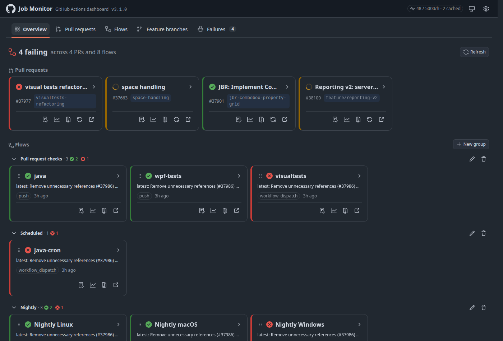

---

## What you get

- A single **Overview** of every PR and flow you track, red/green at a glance.
- **PR checks** with an aggregated status and a drill‑down into every check‑run.
- **Flows** — pick any workflow and watch its runs and jobs, filtered by branch / event; **Browse**
  the repo's last‑24h runs to add a flow without typing anything.
- **Regex flows** — instead of one workflow, give a flow a pattern (e.g. `^nightly-`) and every
  matching workflow shows up as its own card, groupable and draggable like any other.
- **Groups** — organise flows into collapsible groups; each group header tallies passed /
  in‑progress / failed so a collapsed group still tells you what's inside.
- **Drag‑and‑drop** — reorder flows and move them between groups; collapse any card to a thin strip.
- **Export / import** your board (groups + flow order) as JSON to move your setup between machines.
- **Light / dark themes** — a one‑click switcher in the header (auto / light / GitHub's dark dimmed).
- **Logs, summaries and timelines** for any job, right inside the app.
- **Artifact downloads** — grab a run's artifacts as a single `.zip` or bundle several into one
  (in the desktop app, via a downloads panel with progress and a Save button).
- **Desktop notifications** when a PR’s checks or a flow run finish — and, optionally, when jobs
  get re‑run for you.
- **A Failures list** with a ready‑to‑paste bug report for every failing job — across open and
  recently‑merged PRs *and* your flows — in collapsible groups.
- **Auto‑rerun of failed jobs** for PRs waiting on auto‑merge — opt‑in, limited to workflows you
  name.
- **An arm auto‑merge button** on every open PR — clears the description and hands the PR to GitHub
  to merge once its checks pass, after confirming.
- **A Feature branches tab** — for long‑lived branches shared between your fork and the
  upstream. Shows *where each merge has stopped* rather than merely that a pull request exists,
  and offers three actions: bring the default branch into a feature branch, pull the upstream's copy
  of a branch down into your fork, and commit your fork's branch to the upstream's branch of the same
  name. None of them targets the default branch — getting a feature branch into `main` stays
  somebody else's decision.
- **Explain with Claude** (desktop app) — turn a failed job's log into a readable problem statement
  and a suggested fix, using the `gh` and `claude` CLIs already on your machine. Two depths: a
  **quick read** in about a minute, or a **deep analysis** that goes and investigates. It also
  writes the title and description of a pull request shipping a feature branch — you edit the
  result before anything is published, and a browser falls back to a template.
- **A Diagnostics tab** (desktop app, opt‑in) — read Job Monitor's own log live, to see why it did
  what it did: every auto‑rerun decision including the ones that chose *not* to fire, every analysis,
  and every request that failed.

---

## Getting started

### Option A — open the website

Open **<https://ideal-adventure-zzoj21p.pages.github.io/>** in a modern browser
(Chrome/Edge recommended). Nothing to install.

### Option B — install the desktop app

Grab the installer for your OS from the project’s **Releases** page:

| OS | File |
|----|------|
| Windows | `Job Monitor-x.y.z-setup.exe` |
| macOS | `Job Monitor-x.y.z-*.dmg` |
| Linux | `Job Monitor-x.y.z.AppImage` or `.deb` |

> The installers aren’t code‑signed yet, so the first launch may show a Gatekeeper (macOS) or
> SmartScreen (Windows) warning — choose “Open anyway”. On Linux, make the AppImage executable
> (`chmod +x`) and run it.

The desktop app does everything the website does, **plus** it can minimise to the system tray,
keep checking in the background, and show native notifications.

---

## First‑time setup

When you first open Job Monitor you’ll be taken to **Settings** (it opens automatically until a
token is set). You can reopen it any time from the **gear icon in the top‑right corner** — it opens
as a full‑screen page with tabs for **Token & login**, **Repository**, **Polling**, **Flows**,
**PR automation**, **AI integration** and **Notifications** (plus **Diagnostics** and **Updates** in
the desktop app). Three things to do:

### 1. Add your GitHub token (Settings → **Token & login**)

Job Monitor needs a personal access token to read your data. Create a
[**classic token**](https://github.com/settings/tokens/new?scopes=repo&description=Job%20Monitor)
with the **`repo`** scope (or `public_repo` if you only watch public repositories), paste it in,
and choose a **passphrase**.

Next to “loaded in memory” you’ll see what the token can do — for example *classic · `repo` — can
re‑run failed jobs*, or *read‑only — re‑run features hidden*. If it says the re‑run features are
hidden, that’s why the **PR automation** tab has no auto‑rerun controls: the re‑run feature only
appears for a **classic `repo` token on a repository you can write to**. A fine‑grained token never
gets it, even with `actions: write` — GitHub gives a browser no way to check that, so Job Monitor
assumes it can’t rather than showing you a button that fails.

- The token is **encrypted** with your passphrase and stored only in this browser; the plain token
  lives only in memory and is sent only to `api.github.com`.
- On the desktop app you can tick **“Remember on this device”** to unlock automatically next time
  (stored in your OS keychain).
- After the first run you’ll just be asked for the passphrase to unlock.

> A read‑only **fine‑grained** token works for most things but **can’t download Actions logs**
> (GitHub returns 404), so a classic `repo` token is recommended.

### 2. Point it at a repository (Settings → **Repository**)

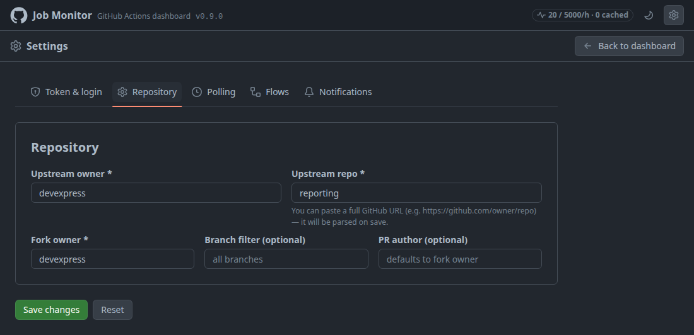

- **Upstream owner / repo** — the repository you’re monitoring (you can paste a full GitHub URL).
- **Fork owner** — whose pull requests into upstream you want to see.
- **Branch filter / PR author** — optional narrowing.

How often everything refreshes lives on the separate **Polling** tab (sensible defaults are filled
in), alongside the rate‑limit warning threshold.

### 3. Add flows to watch (Settings → **Flows**)

A *flow* is any workflow you want to track. Give it a **name**, then choose what it watches:

- **One workflow** — a file name, display name or numeric id, or hit **Browse…** to pick from
  everything that ran in the repo recently and have the fields filled in for you.
- **Every workflow matching a regex** — type a pattern (e.g. `^nightly-`) and every matching
  workflow of the repo becomes its own card on the board. Pick whether the regex is tested against
  the workflow's **name**, its **file name** or **either**, toggle case sensitivity, and cap how
  many matches may expand with **Max matches** (each one polls on its own). The editor lists the
  matches live as you type, so you can see what you're about to watch.

Branches, trigger events, owner/repo overrides and max-runs sit under **Additional settings**,
collapsed by default — a regex flow applies them to every match.

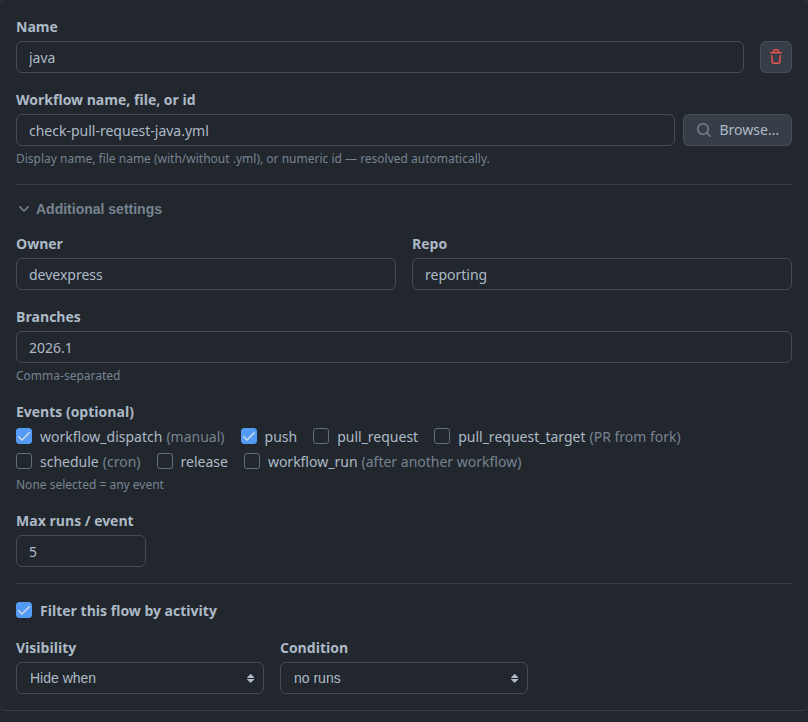

In regex mode the editor tells you what the pattern currently catches — `Matches 3 of 9 workflows` —
and lists them by display name and file, so nothing is a surprise once you save:

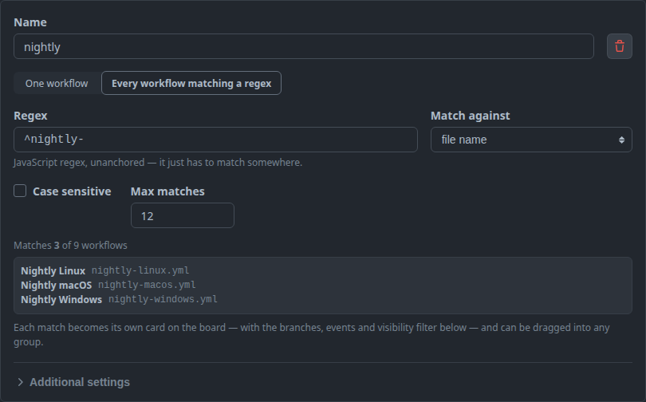

**Browse…** opens a dialog listing every workflow that ran in the repo **in the last 24 hours**,
grouped by workflow × branch × trigger, with each one's status, file, trigger event, branch and
last‑run time. **Search** by name or file and **filter** by trigger or branch, then click a row to
fill the flow's name, workflow file, branch and event in one go.

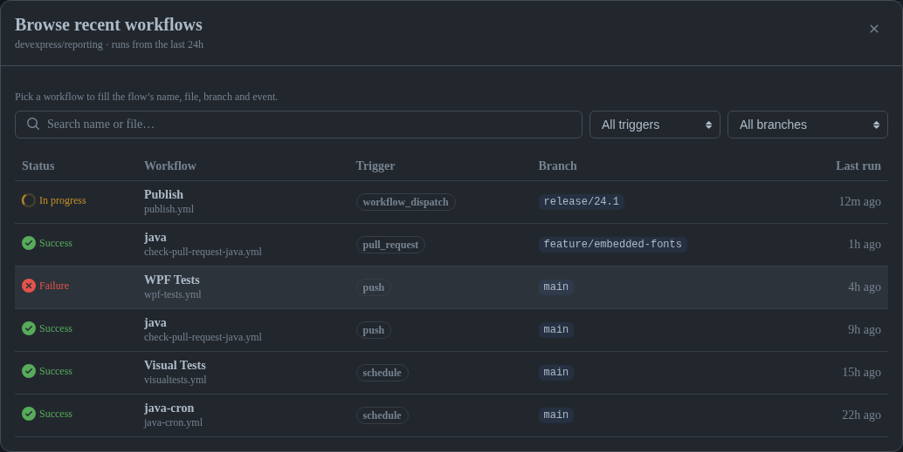

Under Additional settings you can also add a per-flow **visibility filter** — pick **Hide when** or
**Show when**, then a condition: the flow has no runs, only skipped runs, no artifacts, or a named job
ended up in a certain state (e.g. a `test` job was skipped). *Hide when* drops matching flows from the
board; *Show when* keeps only the matching ones.

Click **Save changes** and you’re ready.

---

## Using the dashboard

### Overview

The landing tab rolls everything up: one tile per PR and one per flow, with the latest status,
branch and when it last changed. Flows are arranged into the **groups** you've defined, and each
group header tallies how many flows passed / are running / failed — so a collapsed group still tells
you what's inside. Click a tile to jump straight to its details. The header badge shows how many API
requests you’ve used in the last hour.

### Pull requests

Every open PR from your fork into upstream, with an overall status. Expand a PR to see all its
check‑runs and commit statuses. Filter by **All / Active / Failed / Success**, and use **Compact**
to hide the green noise and show only what needs attention.

If your token can write, each PR also gets a **re‑run** button (the circular arrows). It lists the
failed workflow runs for that commit and lets you re‑run any one’s failed jobs — no need to go to
GitHub and find the run yourself. The PR’s checks start being watched again straight away, so you
see it go back to running.

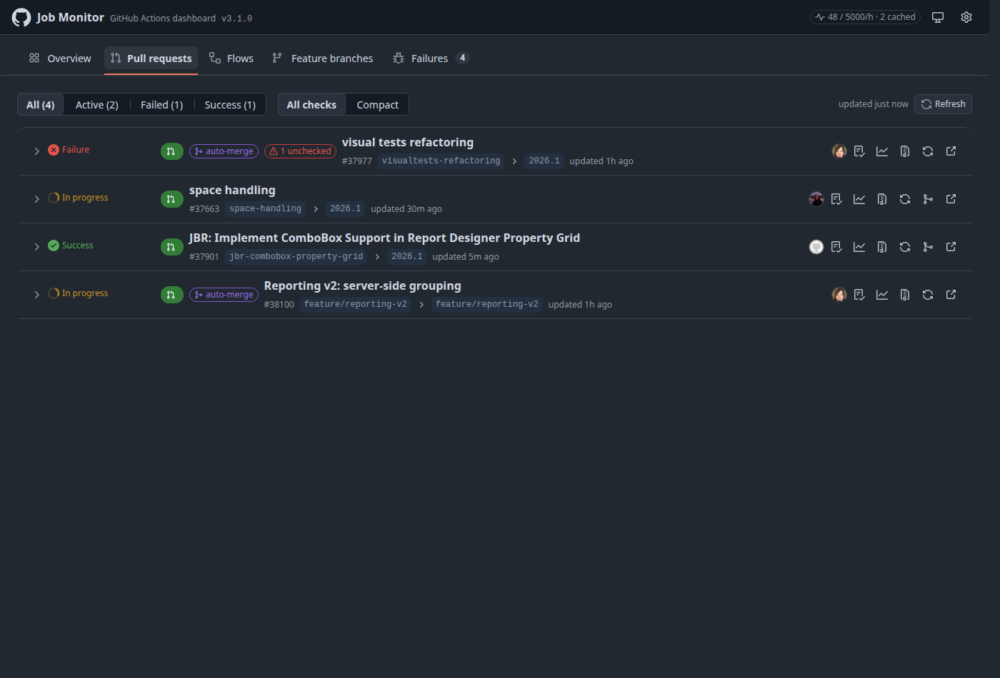

### Failures

The **Failures** tab collects every failing job across your open pull requests *and* the recently
merged ones, so a break is visible the moment a check reports it — the tab title carries a count.
It refreshes on the normal polling cycle; you don’t have to go hunting through PRs.

Pick a failure and you get a **Markdown report** for it, one per job (so one per matrix worker):
the PR and branch, the workflow and run, the step that failed, the **failing tests** with
`file:line` and message, and a tail of that step’s log. Switch between **GitHub** and **Teams**
formatting (Teams can’t render collapsible blocks, so its log is laid out flat), then hit
**Copy markdown** and paste it into an issue or a chat.

Tick several failures to **copy them all at once**, separated by rules. Each report ends with a
short **fingerprint** of the failure, so you can tell at a glance whether two reports are about the
same break — it’s the same value the auto‑rerun uses to decide a failure is deterministic.

The test names are loaded as failures appear, so you don’t have to click anything first. If you’d
rather not spend the extra requests, switch that off under **PR automation → Failure reports**.

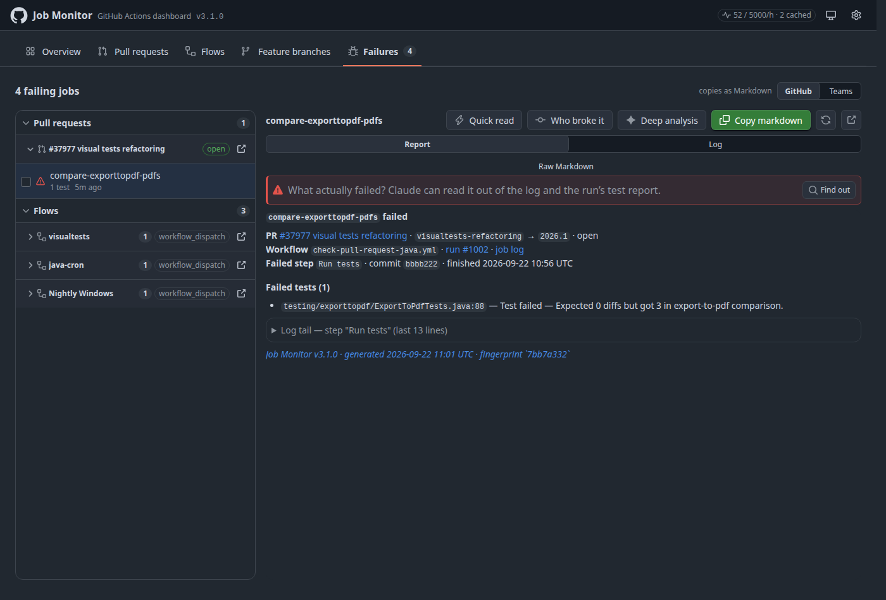

Each row shows what already exists for it — ⚡ a quick read, ✦ a deep analysis, 📄 a rewritten log,
⎇ a traced verdict — so you can see which failures have been looked at without opening them.

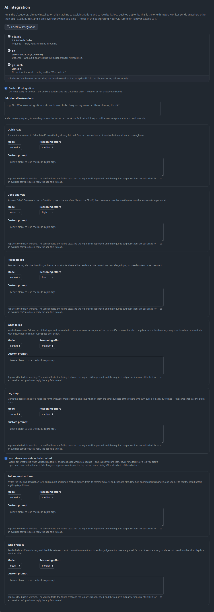

AI is configured under **Settings → AI integration**: one switch for the whole feature, then a model,
a reasoning effort and an optional custom prompt for each of the three tasks, plus **additional
instructions** appended to every request for standing context ("our Windows integration tests are
flaky"). A custom prompt replaces the built-in wording but not the structure — the verified facts, the
failing tests, the log and the required output sections are still added — so it can't produce something
the app fails to read. Turning the switch off hides every AI control; fetching the whole run's log with
`gh` is not an AI feature and keeps working.

**Check AI integration** on that page reports whether `claude` and `gh` are on PATH, their versions and
whether `gh` is signed in — with what each is for and what to do when it's missing. `claude` is
required; `gh` is optional, and without it an analysis uses the log Job Monitor fetched itself.

When something goes wrong, the desktop app keeps a record of it: **Settings → Diagnostics** shows the
path to a log of every analysis — the commands run, how long each took, and how it ended — alongside
every auto‑rerun decision and any request that failed. It holds sizes and outcomes, never your token
and never the contents of a CI log.

Tick **Read the log in a Diagnostics tab** there and the main navigation grows a **Diagnostics** tab
that follows that log live — newest first, filtered by scope, searchable (the search covers the
attached details, so a run id or PR number finds its own records), and each line expandable into the
facts behind it. Handy for “why didn’t auto‑rerun fire?”, which is otherwise invisible from the UI.
Off by default, and desktop‑only.

### Reading the log

Each failure has a **Report** view (what you paste into a bug) and a **Log** view (what you read to
understand it), and the log comes three ways:

- **Job log** — the failing job's own output. No `gh` needed and usually already fetched, so it's the
  default.
- **Whole run** — every failed step of the run, via your local `gh`. This is the one that shows an
  **upstream** job's output, which matters more often than it sounds: a job like `publish-test-summary`
  exits 1 only because a job it `needs:` failed, so its own log can never tell you what broke. Fetched
  when you ask for it and kept for a week.
- **Claude** — the same log rewritten: the decisive lines first, the noise cut (it says how many lines
  it dropped), a short note where a line needs one, and a closing list of what the log *doesn't* show.

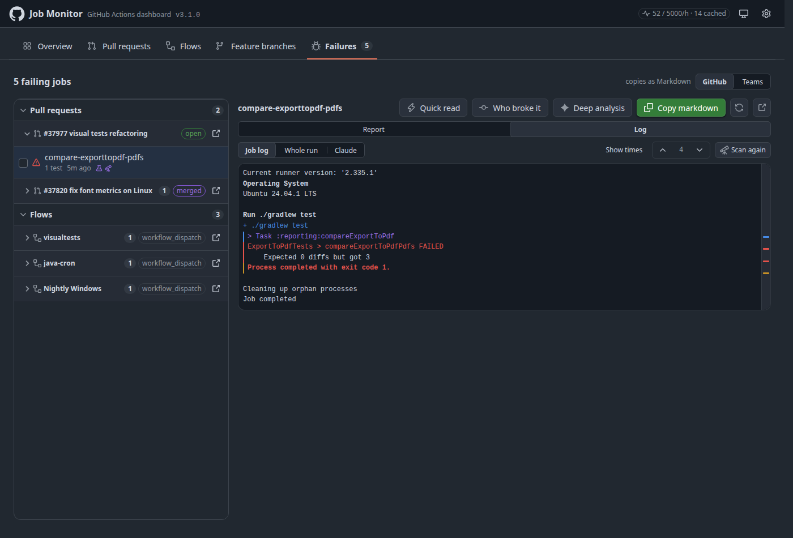

The first two are **coloured** — workflow commands, the command each step ran, failing tests, stack
frames, build sections, success lines — and that colouring is local, so it's instant and costs nothing.
Prose that merely mentions "error" is left plain on purpose: a log where everything is tinted is no
easier to read than one with no colour, and it teaches you to ignore it. Markdown renders properly in
this pane too, and a log quoted inside Claude's explanation is coloured like the log.

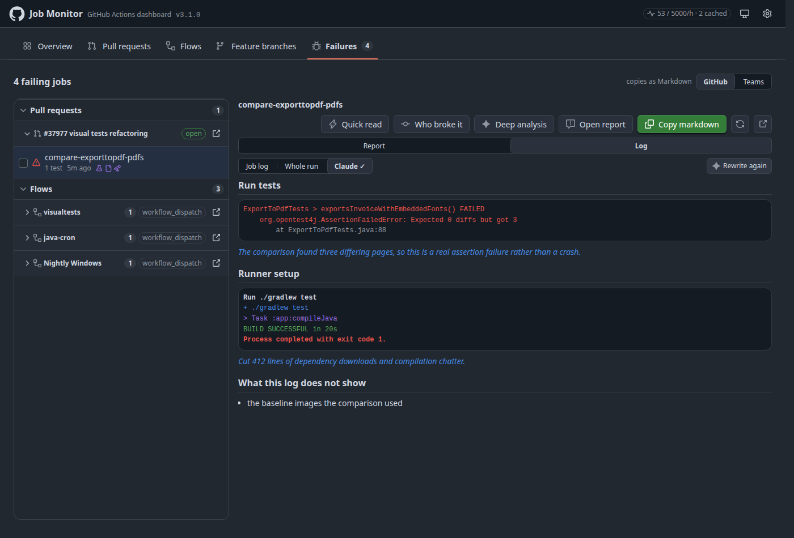

### Explain with Claude (desktop app)

If you're running the **desktop app** with the
[`claude`](https://docs.claude.com/en/docs/claude-code/overview) CLI installed, a failure gets two
buttons next to *Copy markdown*. Having [`gh`](https://cli.github.com/) installed and signed in makes
the deep one better but isn't required — see below.

**Two depths, because the two questions are different.** Triaging a red board, you mostly want to know
*which* failures are yours; occasionally you want to know *why* one of them broke. One button answered
both badly — either too slow to run five times, or too shallow to be worth running once.

| | **Quick read** | **Deep analysis** | **Who broke it** |
|---|---|---|---|
| Answers | what failed | why it failed | **which commit, and whose** |
| Time | about a minute | a few minutes | a few minutes |
| Model | Sonnet, medium | Opus, high | Opus, medium |
| Reads | the log already fetched | the run's log, artifacts, workflow, diff | the branch's run history |
| Tools | none | read-only `gh` and file access | read-only `gh` and file access |

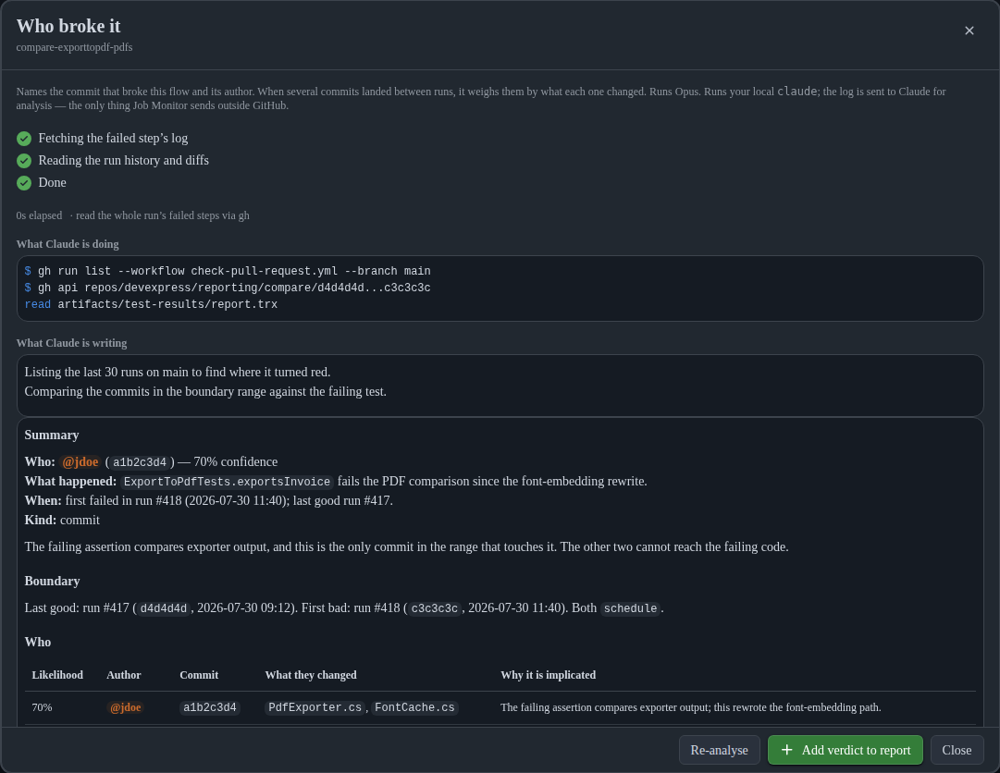

**Who broke it** names the commit and its author. Several commits usually land between two runs, so it
weighs them by what each one changed against the failing test — the code under test, the test's own
fixtures, something the failure text names, a dependency bump — and gives each a likelihood with the
evidence behind it. Arrival order counts for little, and under 40% it says it doesn't know rather than
picking the least-bad guess.

It rules out a flaky test and then infrastructure *before* naming anyone. On a
branch written only through a merge gate, the code has already passed the workflow that is now failing,
so both are likelier than a bad commit — and blaming a developer for someone else's flake is the mistake
worth designing against. It also builds flaky-test evidence by scanning failures of
`check-pull-request.yml` on `main` and the release branches, and reports them as a table of test,
failure count, branches and **links to the runs they failed in**.

The quick read is told it has a **one-minute budget** and must answer from the log in front of it —
no fetching, no asking for more. If the log doesn't say what broke, it says exactly that and names the
one thing worth looking at next, which is a useful answer in a minute and the honest one.

The deep analysis follows a **skill** — `.claude/skills/failure-triage/` — rather than an ad-hoc prompt.
It stays on the job you asked about instead of surveying the pull request, opens a neighbouring job only
when this one structurally can't answer (an aggregator that failed because a `needs:` job did) and says
so when it does, retries a failed artifact download once before falling back, and aims to answer in two
to four tool calls rather than reading everything first. The same skill is checked into the repo, so you
can run the identical procedure by hand in a `claude` session.

The deep analysis **investigates**. A workflow's annotation for a failing test
suite usually says little more than "the step failed", so on its own a model can only reply that there
isn't enough evidence and list what it would need. It has the means to fetch all of that, so it's told
to: grep the raw log for the runner's own `FAILED` lines and stack traces, **download the run's
artifacts** and read the JUnit XML or HTML test report for the failing test names and assertion diffs,
read the workflow file to learn the exact command and how a shard picks its subset, and read the PR's
diff to tell "a test this PR touches" from an unrelated regression.

The progress dialog shows that happening: the phase it's on, the log size fetched, an elapsed counter,
**what Claude is doing** (each `gh`, `grep` and file read as it happens) and **what it's writing** as
the answer streams in, one sentence per line and scrolling to follow the newest — scroll up and it
stops following, so it never yanks the view away mid-read. **Stop** actually kills the local processes
rather than just hiding the dialog.

Under the hood it prefers the **full** failed‑step log for the whole run, via
`gh run view --log-failed` — far more than the tail the report shows. If `gh` isn't there, isn't
signed in, or fails (its log download aborts on large runs with a
`stream error: … CANCEL; received from peer`), it falls back to the failing job's own log, which
Job Monitor has already fetched through the GitHub API. The dialog says which log was used, so a
narrower analysis is never silent. Then your local `claude` reads it, and the report changes shape:

1. **The problem, in prose, at the top** — what broke and where, quoting the decisive log lines, so
   whoever reads the bug report understands it before meeting any metadata. If the log points at
   infrastructure (a dead runner, a registry timeout, a rate limit) rather than the code, it says so,
   because that changes who should pick it up.
2. **The verified links and facts**, exactly as before — the PR or flow, the workflow, the run, the
   job log, the failing tests.
3. **The suggested fix, last and collapsed**, labelled as generated. It's a suggestion sitting next
   to evidence, and the layout keeps that distinction obvious.

Only the prose is written by Claude. Every link, SHA, workflow name and test name in the report comes
from data Job Monitor already fetched, and the prompt tells the model in as many words not to invent
any — a bug report with a confident wrong link is worse than one with no link.

Both analyses feed the report, and the deep one wins when you've run both. The buttons appear when
`claude` is available; if they're missing, check `claude --version`. A finished analysis is marked ✓
and reopening it costs nothing — **Re‑analyse** is there when you do want a fresh one.

Each failure row shows what already exists for it — ⚡ a quick read, ✦ a deep analysis, 📄 a rewritten
log — so you can see which ones have been looked at without opening them. Pull requests and flows carry
a **✦ analysed** badge when one of their failures already has a stored
result, so a week-old red board shows at a glance which parts have been looked at. The quick read, deep
analysis and log rewrite are independent — each shows a spinner in its own button, and all three can run
at once.

Analyses are **kept for a week**, so reopening a failure you looked at yesterday doesn't spend another
call. That's safe because the cache key includes the job id, and re-running failed jobs mints new
ones: a new attempt can never be shown a previous attempt's verdict — it simply has none yet. The two
depths are stored separately, so a quick read never overwrites a deep one.

**What it's allowed to do.** Read-only, and narrowly: read and search files in a throwaway scratch
directory, and run a fixed set of commands — `gh run view`, `gh run download`, `gh api`, `gh pr
view/diff`, plus `unzip`/`grep`/`cat` and friends for looking inside what it downloaded. It has no
write or edit tool and no general shell, it can't touch your working copy, and it never sees your
GitHub token (`gh` uses its own). Downloads land in a temp directory that's deleted when the run ends.

> This is the one feature that sends data outside GitHub — see [Privacy](#privacy).

### Feature branches

Some work lives on a branch that stays around for weeks — a release branch, a big refactor — shared
between your fork and the upstream. **The Pull requests tab cannot show that work at all**: its pull
requests have both ends in the upstream, and that tab filters on your fork being the head. So this
tab exists. It is **on by default**; switch it off under **Settings → PR automation** if your
repositories have no such branches, and nothing is polled or written for it thereafter.

A feature branch is one under a prefix — `feature/` by default — that exists in **both** repositories.
A branch only one of them has is not shared work and does not appear: you cannot pull a branch into a
fork that hasn't got it, and a branch only you have is not something to ship.

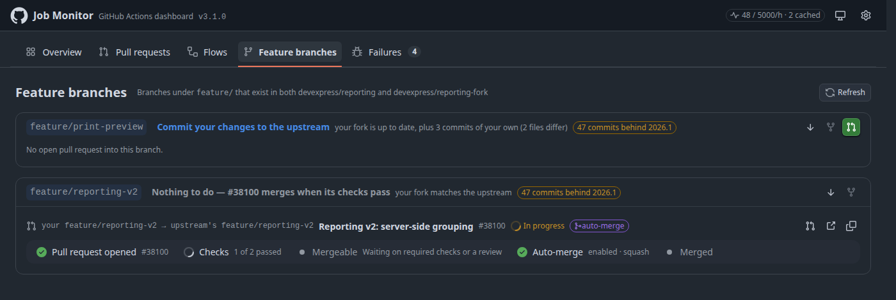

Each branch says, in one line, **what to do about it** — and that is the point of the tab. A pull
request that is merely "open" tells you nothing; the line here is either an action worth taking or
*Nothing to do*, followed by how your fork stands against the upstream: *your fork matches the
upstream*, or *up to date, plus 3 commits of your own (2 files differ)*.

A branch that has fallen behind the branch it will merge into gets a warning next to that:
**`47 commits behind 2026.1`**. This is the number that gets worse on its own — the fork standing
beside it only moves when somebody pushes — and it is what the *bring the default branch in* action
is for. It is measured on the **upstream's** copy of the branch, since that is the shared one, and it
is absent when the branch is level or ahead: a label that appeared on every healthy row would train
you to stop reading it.

Where a pull request exists, a **stage strip** shows how far the merge has actually got:

> **Pull request opened** `#38100` · **Checks** *1 of 2 passed* · **Mergeable** *waiting on required
> checks or a review* · **Auto‑merge** *enabled · squash* · **Merged**

When it is stuck, the reason is spelled out rather than left to be inferred — *behind the base
branch*, *conflicts — this one needs a working copy*, *some checks failed, but none of them are
required*.

#### The three actions

They are the icons on the right of each branch row. Hover one for a sentence naming **both ends** of
what is about to happen — including *why* it is unavailable, since a disabled control that explains
nothing is a dead end.

| | What it does |
|---|---|
| **Bring the default branch in** | Creates `sync/2026.1-into-<branch>` at the default branch's tip and opens a pull request from it into the feature branch |
| **Pull into your fork** | Brings the upstream's copy of the branch down into your fork |
| **Commit to the upstream** | Opens a pull request from your fork's branch into the upstream's branch of the same name |

Each one **confirms first** and tells you what it is about to do:

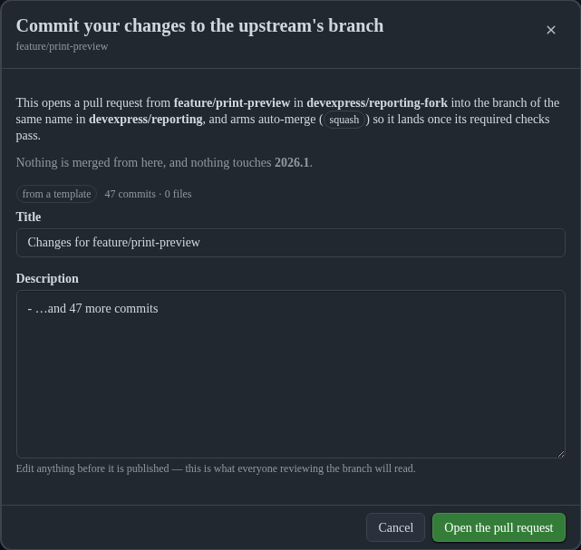

Two things worth knowing about all three:

- **None of them merge, and none of them touch the default branch.** Every action opens a pull
  request and arms auto‑merge; GitHub does the merging once the required checks pass. Landing
  directly in a protected branch is forbidden by branch protection, so a merge button here would be a
  route around the rule that forbids it. Getting a feature branch into `main` stays somebody else's
  decision.
- **They report which of their steps ran**, not just success or failure. These are multi‑step
  writes — "it didn't work" is not a useful thing to be told when a pull request now exists.

On the desktop app, **Claude writes the title and description** of the pull request you commit to the
upstream, from the commits and diff of the branch (see
[Explain with Claude](#explain-with-claude-desktop-app)). You edit it before anything is published.
In a browser, or with the AI integration off, you get the template shown above instead — and issue
references are stripped from whatever comes back either way, since a stray `Fixes #123` closes
somebody's issue the moment the pull request merges.

**Auto‑rerun covers these pull requests too.** They arm auto‑merge, and the dashboard cannot see
them, so without that a single flaky check would park one indefinitely. Every brake applies unchanged
— the workflow allowlist, the attempt ceiling, the identical‑failure streak, the run‑age window and
the rate‑limit throttle.

### Merged pull requests

A failure that landed anyway is easy to lose track of once the PR closes, so Job Monitor keeps the
last few **merged** PRs in view (10 by default; set it to 0 to switch this off under
**PR automation → Merged pull requests**). Their checks are already finished, so they’re fetched
once and then left alone.

### Flows

Each flow is a collapsible card. Expand one to see its recent **runs**; expand a run to load its
**jobs**. Filter runs by status, and use the **Job filter** to find runs that contain a job matching
a name in a given state. **Compact** hides passed/skipped jobs. Cards behave like an accordion —
expanding one collapses the rest — and you can **drag the grip** on the left to reorder flows or move
them between groups.

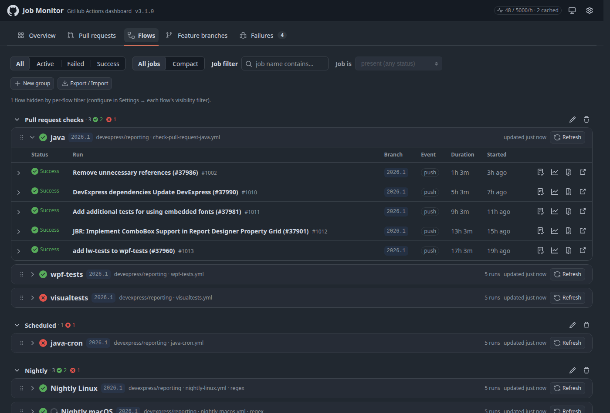

A failing job carries a 🐛 button that opens **that same failure in the Failures tab** — where its
log is coloured, its annotations are listed and its report can be copied. It appears only when the
failure is in that tab's list, so it never lands you somewhere empty.

A **regex flow** shows up as one card per matching workflow — each with its own runs, filters and
place in a group. The `· regex` suffix next to the workflow file marks a card that came from a
pattern (hover it to see which one):

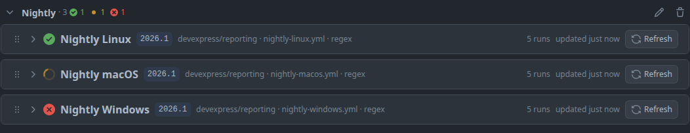

### Groups, drag‑and‑drop and export / import

Both **Overview** and **Flows** let you organise flows into named **groups**. Use **New group** to
create one, drag a flow by its grip to move it between groups or reorder it, and collapse a group to
tuck it away (its header keeps showing the pass/fail tally). Dropping a card into a collapsed group
opens it, so nothing lands out of sight.

Regex matches are dragged exactly like ordinary flows: a match you move keeps that spot (it's
remembered by workflow, not by position), while the rest of the pattern's matches — including
workflows added to the repo later — stay together where you put the pattern.

If a flow behind such a spot disappears — you edited the regex, or the workflow was renamed — the
spot is kept (the card returns when the workflow does) and the group header shows an **N unmatched**
button. Click it to review those leftovers by name and drop the ones you don't want back, one at a
time or all at once; only the placement is removed, never a flow or your regex.

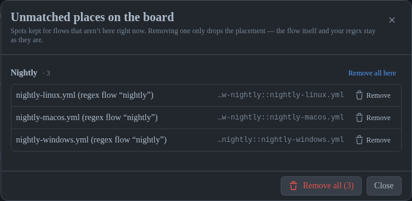

Your layout is saved locally. To move it to another machine — or back it up — use **Export / Import**
in the Flows tab: it serialises your flows and groups (keyed by id) to JSON. Importing replaces the
current board. Your **token and repository coordinates are never included** in the export.

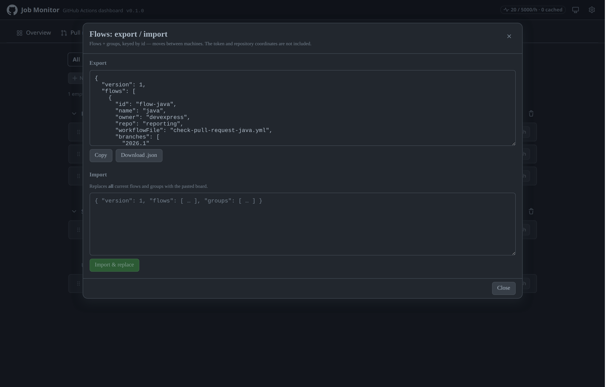

### Theme

A one‑click switcher sits in the header, next to the gear. It cycles **auto → light → dark**, the
icon reflects the current mode, and your choice is remembered. The dark theme uses GitHub's softer
**dark dimmed** palette.

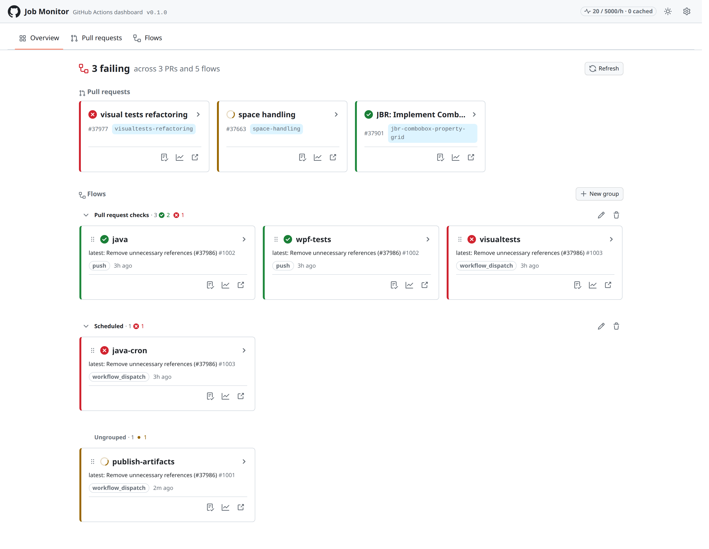

### Job summary, logs and timeline

Every job (and every PR check) has three quick actions:

- **Summary** — the job’s annotations (errors/warnings with file\:line + message) and a per‑step
  status breakdown.

  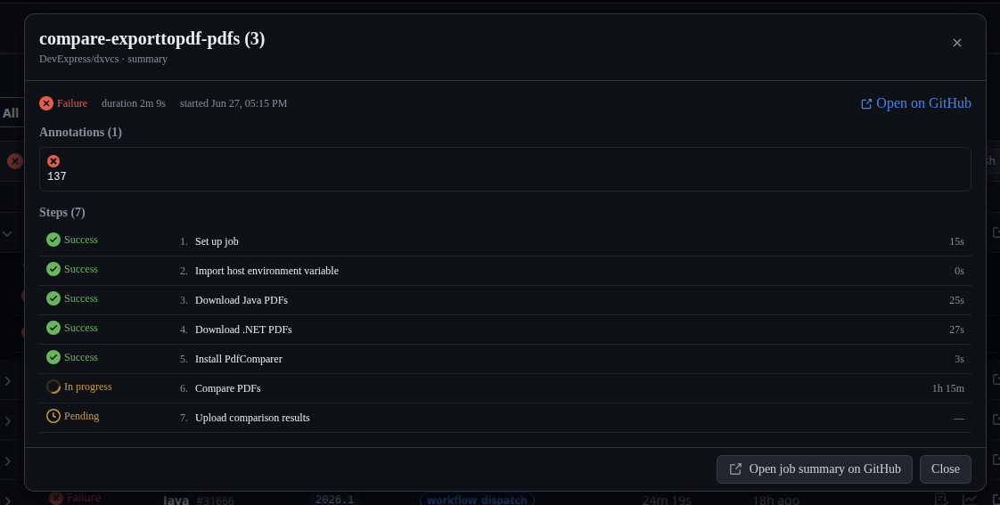

- **Logs** — expand any step to read its log lines, fetched on demand.

  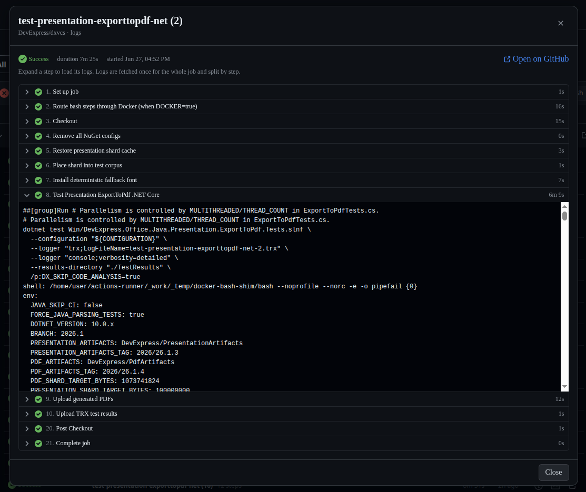

- **Open on GitHub** — jump to the run on github.com.

There’s also a **Timeline** (Gantt) button on each PR and flow run: bars positioned by start time
and sized by duration, splitting **runner allocation** (queue + “Set up job”) from the actual
**work** — so it’s obvious whether time went to waiting or running.

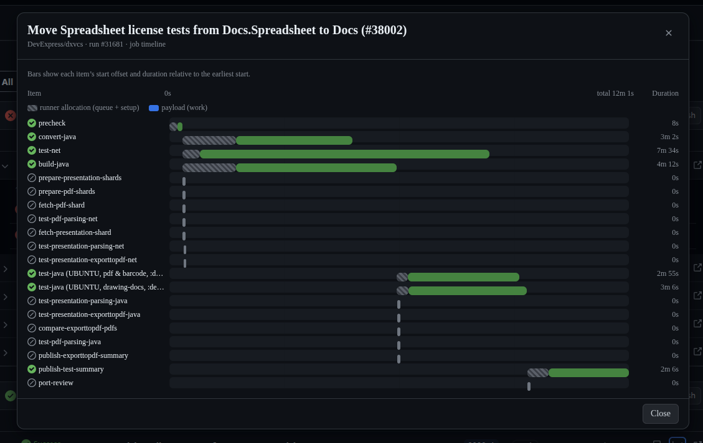

### Artifacts

Flow runs, pull requests, **and their Overview tiles** all show an **artifacts** button (the zip
icon). It opens a dialog listing the run's uploaded artifacts (sorted by name, with sizes). Download
any one as its own `.zip`, or tick several — or hit **Download all** — to get **one combined `.zip`
with a folder per artifact**. The list is fetched only when you open the dialog, so it costs nothing
until you ask. (Expired artifacts are shown but can't be downloaded — GitHub deletes them after the
retention window.)

> Artifacts belong to a **run** in GitHub's API, not to an individual job, so they're listed per run.

In the **desktop app**, downloads don't save immediately: they appear in a **Downloads panel** (the
tray-arrow button, top-right) with progress, and you press **Save** there to write the file to your
Downloads folder — with a "Show in folder" shortcut and a completion alert. In the **browser**, your
browser handles the download as usual.

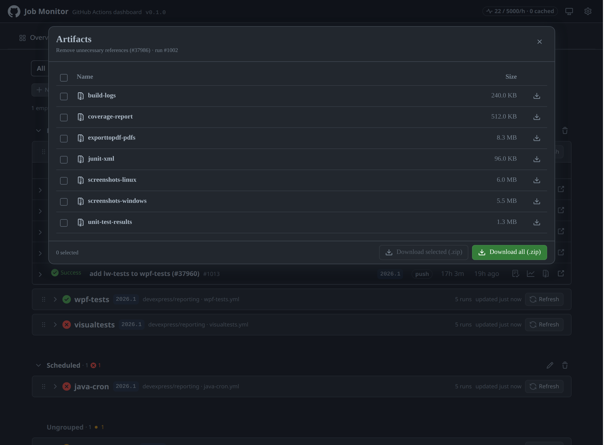

### Auto‑rerun failed jobs (Settings → **PR automation**)

Flaky CI blocking an auto‑merge PR is pure waiting: somebody has to notice the failure and click
“Re‑run failed jobs”. Job Monitor sees it first, so it can do the clicking.

Turn on **Re‑run failed jobs automatically** and name the workflows it applies to. The field is a
combobox over your repo’s actual workflows — start typing and pick one, so you can’t arm a
misspelled file name (you *can* still type one by hand for a workflow that hasn’t run yet).

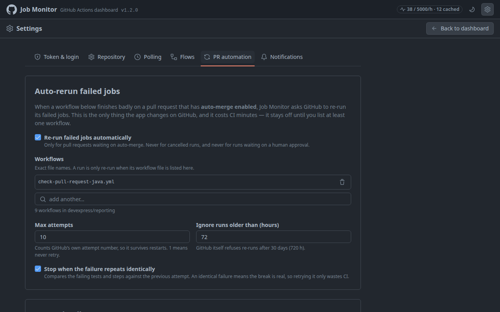

A run is only re‑run when **all** of this holds:

- the pull request has **auto‑merge enabled** — someone has already said “land this when it’s green”;
- the run’s workflow file is one you listed;
- the run has **finished**, and finished as **failed** or **timed out**. A **cancelled** run is left
  alone (a cancel is normally deliberate), and so is one waiting on a human approval;
- the failure is **recent** — within 72 hours by default. That's measured from the **last attempt**,
  not from the commit: a PR that is actively being retried is as fresh as its most recent try, so a
  long‑lived branch doesn't quietly age out while its last run was an hour ago. (GitHub separately
  refuses any re‑run more than 30 days after a run first started; nothing can reopen that.)

Two brakes stop a genuinely broken PR from burning CI forever:

- **Max attempts** (10 by default) counts GitHub’s own attempt number, so the limit holds across
  restarts and even if you re‑run something by hand.
- **Allow the same failure this many times** (5 by default) compares the failing tests and steps
  between attempts. A flaky test can fail the same way twice and pass on the third go, so identical
  failures are tolerated — but only up to this count, because past it the break is real and retrying
  is just waste. A *different* failure in between starts the count over; **0** switches the brake off
  and retries up to the attempt limit.

If Job Monitor **can't** compare a failure — GitHub wouldn't list the run's jobs, or the run claims to
have failed with no failed job in it — it does **not** re-run. Retrying blind would quietly suspend
the limit above at the worst possible moment. It says so on the PR badge and in the diagnostics log,
with the reason, and tries again on the next poll.

Unlike the notifications, this doesn’t only react to failures that happen while you watch: a run
that failed while the app was closed is picked up when you next open it. Job Monitor remembers what
it has already asked for, so reopening the app never re‑runs the same thing twice.

What it has done shows up as a badge **on the pull request itself** in the **Pull requests** tab —
`re-run ×3` — so a re‑run is never silent and you can see which PR it happened to while scanning the
list. Hover it for the detail: every attempt with its workflow and time, and, if the engine has since
gone idle, why. The badge covers the current session; the full history, including every decision *not*
to re‑run, is in the diagnostics log.

> The re‑run controls are **hidden** unless your token is verified as able to use them — see
> [First‑time setup](#1-add-your-github-token-settings--token--login).

### Arm auto‑merge (Settings → **PR automation**)

Every open pull request carries a **merge** button that does two things at once:

1. **Deletes the PR description.**
2. **Arms auto‑merge**, so GitHub merges the PR as soon as its required checks pass — immediately, if
   they already do.

It always confirms first, and shows you the description it is about to delete, because that text
**cannot be recovered**: a pull request body has no edit history for this app or the API to restore
it from.

Clearing happens *before* arming, deliberately — a PR that is already green merges within seconds of
being armed, so clearing afterwards would race the merge and lose. The consequence is stated where it
matters: if arming then fails (the repository forbids auto‑merge, or the branch has no required
checks), the dialog tells you the description is already gone rather than implying nothing happened.

Pick the **merge strategy** in Settings → PR automation — squash (the default), merge commit, or
rebase. It has to be one the repository allows, or GitHub refuses to arm it and says so in the dialog.

A PR that **already** has auto‑merge armed shows an `auto-merge` badge instead of the button — GitHub
errors on arming those, so there is no action to offer, and the badge says why the button isn't there.
Hover it for the strategy and who armed it. That badge shows whatever your token can do, since it is
also how you tell at a glance which PRs the auto‑rerun engine will act on.

The button itself is absent for anything that isn't open, and whenever the token can't write.

### Notifications (Settings → **Notifications**)

Opt in — separately for **PRs**, **Flows** and **auto‑reruns** — to get a desktop notification the
moment a tracked PR’s checks finish, a flow run completes, or failed jobs get re‑run for you. For
PRs and flows you’ll only be notified about things that finish while you’re watching, never about
items that were already done. The auto‑rerun notification also fires when a re‑run was **refused**,
so a silent failure can’t slip past.

In the **desktop app**, notifications keep working even when the window is hidden in the tray — and
so does the auto‑rerun, at the slower background polling rate.

---

## Desktop app extras

- **Tray** — closing or minimising the window tucks it into the system tray; it keeps checking in
  the background. Right‑click the tray icon for **Open / Check for updates / About / Exit**.
- **Auto‑update** — the app can download and install new versions automatically. Toggle it in
  **Settings → Updates** (a desktop‑only tab; available on the `.exe` / `.dmg` / AppImage builds).

---

## Privacy

Job Monitor is **backend‑less** for everything it does for you. Your token is encrypted locally, and
your GitHub data goes only to `api.github.com` (plus GitHub’s log storage when you open logs).

The **desktop app** additionally sends anonymous usage and crash telemetry. The **web version is
unaffected** — it collects nothing, stores nothing and sends nothing. Details below.

Every request is a read, with exactly two exceptions, and both are hidden entirely unless your token
is verified as able to perform them:

- **Re‑running failed jobs.** Off until you switch it on, and limited to workflow files you list by
  name.
- **Arming auto‑merge on a pull request**, which also clears that PR's description. Only ever from an
  explicit click, and only after a dialog that shows you the description it is about to delete.

Nothing else is written. Job Monitor cannot start a workflow, cancel a run, push code, comment,
merge a PR itself, or change any repository setting — those two endpoints are the only writes in the
codebase, and every write in the app goes through a single function that refuses to run at all unless
the token has been proven capable.

### Telemetry (desktop app only)

The desktop app reports anonymous usage and crash data so we can see which features are worth
keeping and which releases broke something. **It is always on and there is no opt‑out.** Since you
can't turn it off, you can at least see all of it: **Settings → Diagnostics → Telemetry** shows the
exact records queued on your machine, before and after they are sent.

**What is sent**

- A random 128‑bit **installation ID**, generated on first run. It is not derived from your
  username, hostname, MAC address, machine GUID, or any hardware identifier, and there is no mapping
  anywhere from it back to a person. It identifies an installation, not you.
- **Feature counters** — how many times each feature was used, as numbers against a fixed list
  (`flows`, `artifacts`, `auto‑rerun`, …). There is no free‑text field anywhere in the format, so
  nothing about *your* repositories can travel in one.
- **Operation timings**, as histograms — counts per duration bucket, plus sum and max. Individual
  timings are never sent.
- **Usage summaries** in one‑hour buckets — app starts, sessions, foreground time, running time,
  clean shutdowns.
- **Crashes** — the exception *type*, a fingerprint, and a sanitized stack trace.

**What is never sent**

Your GitHub token. Repository, branch, PR, workflow, job or artifact names. Log or annotation
contents. File paths, filenames, usernames, hostnames, IP addresses, command‑line arguments or
environment variables. Exception *messages* — only the type — because a message is the one place a
path or a token realistically leaks into a crash report. Stack traces are stripped of absolute
paths, home directories and usernames before they are written to disk, and the server rejects
anything that still looks like a path, URL, email or token.

**How it is sent**

Counters are accumulated in memory and written to a local queue every 15 minutes. About once an
hour the queue is encrypted and published through [Ably](https://ably.com), a managed pub/sub
service that carries the payload without being able to read it. The queue is capped at a few megabytes and 7
days; if you are offline it simply waits, and if it fills up it drops the oldest records. **A failed
send never affects the app.**

The raw queue lives next to the diagnostics log, under your user data directory
(`%APPDATA%\Job Monitor\telemetry` on Windows, `~/Library/Application Support/Job Monitor/telemetry`
on macOS, `~/.config/Job Monitor/telemetry` on Linux). It is newline‑delimited JSON — readable with
any text editor.

Full field‑by‑field documentation, including the wire schema, is in
**[docs/telemetry.md](docs/telemetry.md)**.

---

## Changelog

Release notes for each version live in **[CHANGELOG.md](CHANGELOG.md)**.

---

## For developers

Building, deploying, the configuration JSON schema and the internal architecture are documented in
**[development.md](development.md)**.
